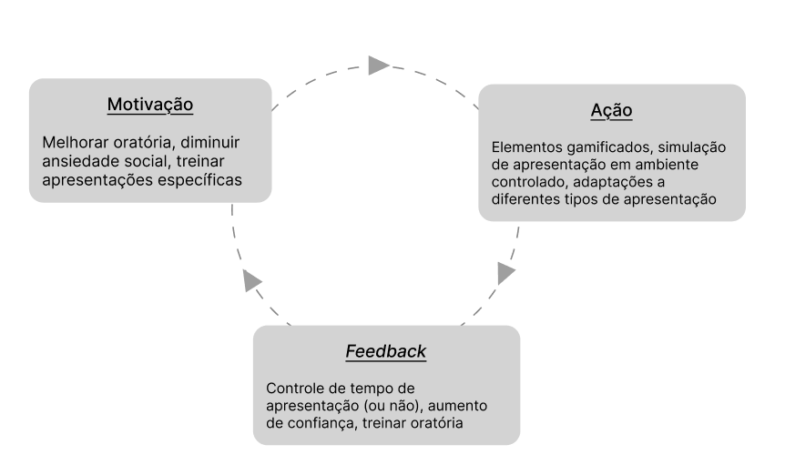
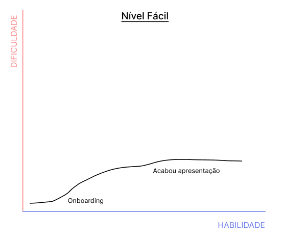
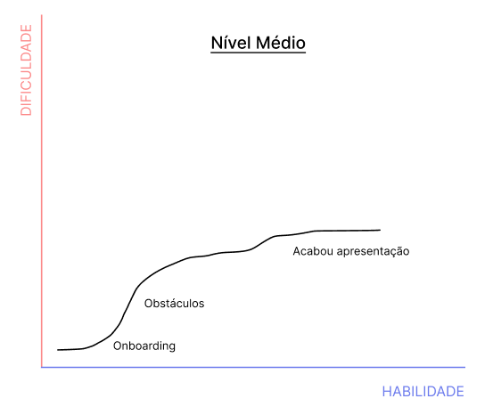
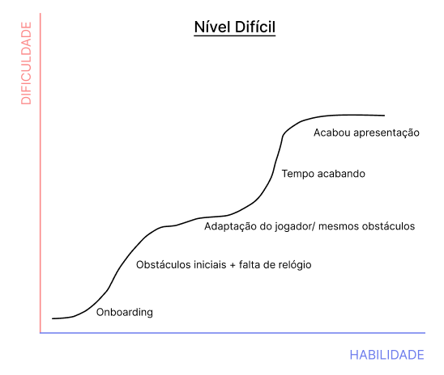

## O ciclo de interação
&emsp; O ciclo de interação é um processo que mapeia as interações do usuário dentro de uma experiência, permitindo que ele receba retornos constantes sobre suas ações e decisões. Esse ciclo é fundamental para o aprendizado e aprimoramento contínuo, especialmente em ambientes gamificados, onde o engajamento do usuário é crucial.

&emsp; No contexto do nosso projeto de treino de pitch em realidade virtual, o ciclo de interação é comporto por 3 etapas principais: Motivação, Ação, Feedback. Cada etapa desempenha um papel na experiência do usuário, garantindo que ele possa aprender e melhorar suas habilidades de comunicação de forma eficaz.

## Flow

&emsp; O conceito de flow, ou estado de fluxo, refere-se a um estado mental em que o indivíduo está completamente imerso e focado em uma atividade, experimentando uma sensação de envolvimento total e satisfação. Esse estado é caracterizado por um equilíbrio entre o desafio da tarefa e as habilidades do indivíduo, onde ele se sente capaz de enfrentar os desafios apresentados sem se sentir sobrecarregado ou entediado.

&emsp; No contexto do nosso projeto de treino de pitch em realidade virtual, o objetivo é criar uma experiência que facilite a entrada do usuário no estado de flow durante suas práticas de apresentação. Para isso, é essencial que o ambiente e as atividades sejam projetados de forma a manter um equilíbrio adequado entre desafio e habilidade. Isso pode ser alcançado através da personalização dos níveis de dificuldade, fornecimento de feedback constante e criação de um ambiente imersivo que mantenha o usuário engajado e motivado a melhorar suas habilidades de comunicação.

### Níveis de Desafio

